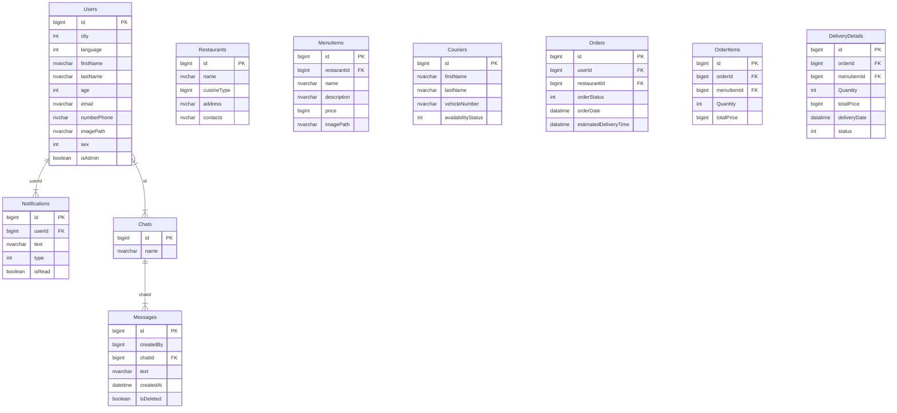

# Gusto | Documentation | API Documentation

## Description
Gusto is an online web platform for food delivery from your favorite restaurant or cafe in your city. The site effectively allows you to order from the restaurant, calculate the time and price of delivery, track the courier and contact if necessary.

Content:


## Technologies:

- Task should be implemented on Typescript

Backend:
- Platform: Node.js
- Network: REST, WebSockets
- Framework: express
- Database: MySql
- Cloud: Azure
- Other: JWT, Firebase, Docker

## Implementation details

Base URL

```
 http://localhost:4200/api/
```

## Extensions for frontend development
- ESLint (analysis tool that checks TypeScript\JavaScript code for readability, maintainability, and functionality errors)
- EditorConfig (helps maintain consistent coding styles for multiple developers working on the same project)

## Links
[Trello Board]()

## Install

Clone repo

```
git clone https://github.com/NadiaMaksymchuk/Gusto.git
```

Go to project folder

```
cd src/app
```

Install dependencies

```
npm i
```

## Environment variables


## DB Schema

