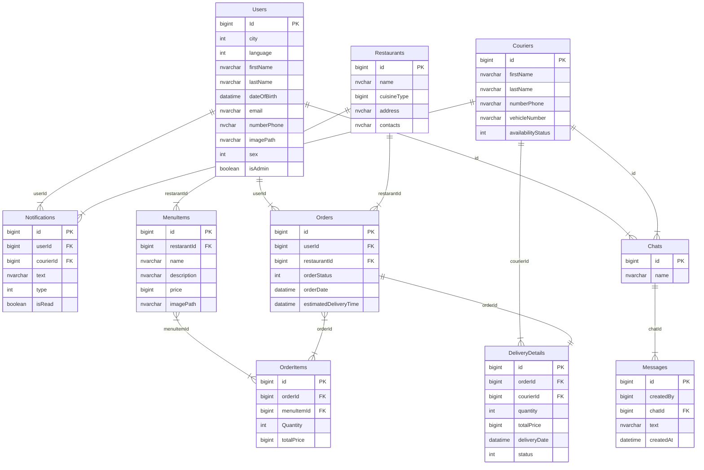

# Gusto | Documentation | API Documentation

## Description <a name="go-up"></a>
Gusto is an online web platform for food delivery from your favorite restaurant or cafe in your city. The site effectively allows you to order from the restaurant, calculate the time and price of delivery, track the courier and contact if necessary.

## Content:

1. [Technologies](#technologies)

2. [Implementation details](#implamentetion-details)

3. [Extensions for development:](#extensions)

4. [Links](#links)

5. [Install:](#install)
    - [Backend:](#install-backend)

6. [Environment variables:](#environment-variables)

7. [Endpoints:](#endpoints)
   - [Endpoints: users](#users)
   - [Endpoints: notifications](#notifications)
   - [Endpoints: restaurants](#restaurants)
   - [Endpoints: chats](#chats)
   - [Endpoints: menuitems](#menuitems)
   - [Endpoints: couriers](#couriers)
   - [Endpoints: orders](#orders)
   - [Endpoints: orderitems](#orderitems)
   - [Endpoints: deliverydetails](#deliverydetails)
   - [Endpoints: messages](#messages)

8. [DB Schema](#db-schema)

## Technologies: <a name="technologies"></a>

- Task should be implemented on Typescript

Backend:
- Platform: Node.js
- Network: REST, WebSockets
- Framework: express
- Database: MySql
- Cloud: Azure
- Other: JWT, Firebase, Docker

[Go Up](#go-up)

## Implementation details <a name="implamentetion-details"></a>

Base  Backend

```
 http://localhost:5000/api/
```

## Extensions for development <a name="extensions"></a>
- ESLint (analysis tool that checks TypeScript\JavaScript code for readability, maintainability, and functionality errors)

## Links <a name="links"></a>
[Trello Board]()

# Install <a name="install"></a>

## Backend <a name="install-backend"></a>

Clone repo

```
git clone https://github.com/NadiaMaksymchuk/Gusto.git
```

Go to project folder

```
cd src/app
```

Install dependencies

```
npm i
```

## Environment variables  <a name="environment-variables"></a>

[Go Up](#go-up)

# Endpoints: <a name="endpoints"></a>

## Endpoint `api/users`: <a name="users"></a>

- Request: `GET api/users`

    - Description: Get a list of all users.  Only admin users can perform this action.

- Request: `GET api/users/{userId}`

    - Description: Get a user by their ID.

- Request: `PUT api/users/{userId}`

    - Description: Change properties in a user account based on their ID. This is used to update user information.

- Request: `POST api/users`
    - Query Parameters

      | Parameter | Type   | Required | Description               |
      |-----------|--------|----------|---------------------------|
      | `city`    | int    | Yes      | City information.         |
      | `language`| int    | Yes      | Language preference.      |
      |`firstName`| string | Yes      | User's first name.        |
      | `lastName`| string | Yes      |  User's last name.        |
      |`dateOfBirth`| datatime | Yes      | User's date of birth. |
      | `email`    | string | Yes     | User's email address.     |
      | `numberPhone`| string | Yes   |  User's phone number.     |
      | `imagePath`| string | Yes      | Path to the user's image.|
      | `sex `    | int    | Yes      | User's gender.            |

    - Description: Create a new user.


- Request: `DELETE api/users/{userId}`
    - Query Parameters:
      userId (string) - The user ID for deleting the account.

    - Description: Delete a user account. Only admin users can perform this action.

[Go Up](#go-up)

## Endpoint `api/notifications`: <a name="notifications"></a>

- Request: `GET api/notifications`

    - Query Parameters
    
    | Parameter | Type   | Required | Description               |
    |-----------|--------|----------|---------------------------|
    | `userId`  | bigint | No      | The ID of the user to whom the notification is associated.|
    |`courierId`| bigint | No      | The ID of the courier related to the notification.|
    |`text`     | string | No      | The content of the notification.|
    | `type`    | int    | No      |  The type of notification.|
    |`isRead`   | boolean| No      | Indicates whether the notification has been read by the user.|

    - Description: Retrieve a list of notifications.

- Request: `GET api/notifications/{id}`

    - Description: Retrieve a single notification by its unique identifier.

- Request: `PUT api/notifications/{id}`

    - Description: Update an existing notification by its unique identifier.

- Request: `POST api/notifications`
    - Query Parameters

      | Parameter | Type   | Required | Description               |
      |-----------|--------|----------|---------------------------|
      | `userId`  | bigint | Yes      | The ID of the user to whom the notification is associated.|
      |`courierId`| bigint | Yes      | The ID of the courier related to the notification.|
      |`text`     | string | Yes      | The content of the notification.|
      | `type`    | int    | Yes      |  The type of notification.|
      |`isRead`   | boolean| Yes      | Indicates whether the notification has been read by the user.|

    - Description: Create a new notification.


- Request: `DELETE api/notifications/{id}`

    - Description: Delete a notification by its unique identifier.


- Example Request

  ```
    GET /notifications?userId=123&isRead=true
  ```

- Example Response
  ```
    [
      {
        "id": 1,
        "userId": 123,
        "courierId": 456,
        "text": "Your package has been delivered.",
        "type": 1,
        "isRead": true
      },
      {
        "id": 2,
        "userId": 123,
        "courierId": 789,
        "text": "New promotion available!",
        "type": 2,
        "isRead": true
      }
    ]
  ```
[Go Up](#go-up)

## Endpoint `api/restaurants`: <a name="restaurants"></a>
- Request: `GET api/restaurants`

    - Description: Retrieve a list of restaurants. 

- Request: `GET api/restaurants/{id}`

    - Description: Retrieve a single restaurant by its unique identifier.

- Request: `PUT api/restaurants/{id}`

    - Description: Update an existing restaurant by its unique identifier.  Only admin users can perform this action.

- Request: `POST api/restaurants`
    - Query Parameters

      | Parameter | Type   | Required | Description               |
      |-----------|--------|----------|---------------------------|
      | `name`    | string | Yes      | The name of the restaurant.|
      |`cuisineType`| int  | Yes      | The type of cuisine offered by the restaurant. This property may refer to another resource or use an identifier for the cuisine type.|
      |`address`  | string | Yes      | The address of the restaurant.|
      | `contacts`| string | Yes      |  Contact information for the restaurant.|

    - Description: Create a new restaurant.  Only admin users can perform this action.


- Request: `DELETE api/restaurants/{id}`

    - Description: Delete a restaurant by its unique identifier.  Only admin users can perform this action.


- Example Request

  ```
    GET /restaurants
  ```

- Example Response
  ```
    [
      {
        "id": 1,
        "name": "The Tasty Bites",
        "cuisineType": 1,
        "address": "123 Main Street, City, Country",
        "contacts": "Phone: (123) 456-7890, Email: info@tastybites.com"
      },
      {
        "id": 2,
        "name": "Pasta Paradise",
        "cuisineType": 2,
        "address": "456 Oak Avenue, Town, Country",
        "contacts": "Phone: (987) 654-3210, Email: pasta@paradise.com"
      }
    ]
  ```

  [Go Up](#go-up)

## Endpoint `api/chats`:  <a name="chats"></a>
- Request: `GET api/chats`

    - Description: Retrieve a list of chat rooms or conversations.

- Request: `GET api/chats/{id}`

    - Description: Retrieve a specific chat room by its unique identifier.

- Request: `POST api/chats`
    - Query Parameters

      | Parameter | Type   | Required | Description               |
      |-----------|--------|----------|---------------------------|
      | `name`    | string | Yes      |The name or title of the chat.|

    - Description: Create a new restaurant.


- Request: `DELETE api/chats/{id}`

    - Description: Delete a chat room or conversation by its unique identifier.


- Example Request

  ```
    GET /chats
  ```

- Example Response
  ```
    [
      {
        "id": 1,
        "name": "General Chat"
      },
      {
        "id": 2,
        "name": "Support Chat"
      }
    ]
  ```

  [Go Up](#go-up)

## Endpoint `api/menuitems`:  <a name="menuitems"></a>
- Request: `GET api/menuitems`

    - Description: Retrieve a list of menu items.

- Request: `GET api/menuitems/{id}`

    - Description: Retrieve a specific menu item by its unique identifier.

- Request: `PUT api/menuitems/{id}`

    - Description: Update an existing menu item by its unique identifier. Only admin users can perform this action.

- Request: `POST api/menuitems`
    - Query Parameters

      | Parameter | Type   | Required | Description               |
      |-----------|--------|----------|---------------------------|
      |`restaurantId`| bigint | Yes      | The ID of the restaurant to which the menu item belongs.|
      |`name`     | string | Yes      | The name of the menu item.|
      |`description`| string | Yes      | A description of the menu item.|
      | `price`   | bigint | Yes      |  The price of the menu item.|
      | `imagePath`| string | Yes      | The path to an image representing the menu item.|

    - Description: Create a new menu item. Only admin users can perform this action.


- Request: `DELETE api/menuitems/{id}`

    - Description: Delete a menu item by its unique identifier.  Only admin users can perform this action.


- Example Request

  ```
    GET /menuitems
  ```

- Example Response
  ```
    [
      {
        "id": 1,
        "restaurantId": 1,
        "name": "Spaghetti Carbonara",
        "description": "Creamy pasta with bacon and parmesan cheese.",
        "price": 12.99,
        "imagePath": "https:testcloud/images/spaghetti.jpg"
      },
      {
        "id": 2,
        "restaurantId": 1,
        "name": "Margherita Pizza",
        "description": "Classic tomato, mozzarella, and basil pizza.",
        "price": 10.99,
        "imagePath": "https:testcloud/images/pizza.jpg"
      }
    ]
  ```

[Go Up](#go-up)

## Endpoint `api/couriers`:  <a name="couriers"></a>
- Request: `GET api/couriers`
    - Query Parameter:

    | Parameter | Type    | Required | Description               |
    |-----------|-------- |----------|---------------------------|
    |`availabilityStatus `| int | No | Filter couriers by their availability status.|

    - Description: Retrieve a list of couriers.

- Request: `GET api/couriers/{id}`

    - Description: Retrieve a specific courier by their unique identifier.

- Request: `PUT api/couriers/{id}`

    - Description: Update an existing courier by their unique identifier.

- Request: `POST api/couriers`
    - Query Parameters

      | Parameter | Type   | Required | Description               |
      |-----------|--------|----------|---------------------------|
      |`firstName`| string | Yes      | The first name of the courier.|
      |`lastName` | string | Yes      | The last name of the courier.|
      |`numberPhone`| string | Yes    | The phone number of the courier.|
      | `vehicleNumber`| int | Yes    |  The number associated with the courier's vehicle |

    - Description: Create a new menu item. Only admin users can perform this action.


- Request: `DELETE api/couriers/{id}`

    - Description: Delete a courier by their unique identifier.  Only admin users can perform this action.


- Example Request

  ```
    GET /couriers
  ```

- Example Response
  ```
    [
      {
        "id": 1,
        "firstName": "John",
        "lastName": "Doe",
        "numberPhone": "(123) 456-7890",
        "vehicleNumber": "ABC123",
        "availabilityStatus": 1
      },
      {
        "id": 2,
        "firstName": "Jane",
        "lastName": "Smith",
        "numberPhone": "(987) 654-3210",
        "vehicleNumber": "XYZ456",
        "availabilityStatus": 1
      }
    ]
  ```


## Endpoint `api/orders`:  <a name="orders"></a>
- Request: `GET api/orders`
    - Query Parameter:

    | Parameter | Type    | Required | Description               |
    |-----------|-------- |----------|---------------------------|
    |`userId `  | bigint  | No       | Filter orders by the user's ID.|
    |`restaurantId`|bigint| No       | Filter orders by the restaurant's ID.|
    |`orderStatus`| int   | No       | Filter orders by their status.|

    - Description: Retrieve a list of orders.

- Request: `GET api/orders/{id}`

    - Description: Retrieve a specific order by its unique identifier.

- Request: `POST api/orders`
    - Query Parameters

      | Parameter | Type    | Required | Description               |
      |-----------|-------- |----------|---------------------------|
      |`userId `  | bigint  | Yes      | Filter orders by the user's ID.|
      |`restaurantId`|bigint| Yes      | Filter orders by the restaurant's ID.|
      |`orderStatus`| int   | Yes      | Filter orders by their status.|

    - Description: Place a new order.


- Request: `DELETE api/orders/{id}`

    - Description: Update an existing order by its unique identifier.


- Example Request

  ```
    GET /orders
  ```

- Example Response
  ```
    [
      {
        "id": 1,
        "userId": 123,
        "restaurantId": 456,
        "orderStatus": 1,
        "orderDate": "2023-10-12T15:30:00Z",
        "estimatedDeliveryTime": "2023-10-12T16:30:00Z"
      },
      {
        "id": 2,
        "userId": 123,
        "restaurantId": 789,
        "orderStatus": 1,
        "orderDate": "2023-10-12T16:00:00Z",
        "estimatedDeliveryTime": "2023-10-12T17:00:00Z"
      }
    ]
  ```
[Go Up](#go-up)

## Endpoint `api/orderitems`: <a name="orderitems"></a>
- Request: `GET api/orderitems`
    - Description: Retrieve a list of order items.

- Request: `GET api/orderitems/{id}`

    - Description: Retrieve a specific order item by its unique identifier.

- Request: `POST api/orderitems`
    - Query Parameters

      | Parameter | Type    | Required | Description               |
      |-----------|-------- |----------|---------------------------|
      |`orderId`  | bigint  | Yes      | The ID of the order to which the item belongs.|
      |`menuItemId`|bigint| Yes      | The ID of the menu item that was ordered.|
      |`quantity`| int   | Yes      | The quantity of the menu item in the order.|
      |`totalPrice`| bigint   | Yes      | The total price for the quantity of the menu item.|

    - Description: Add a new item to an existing order.


- Request: `DELETE api/orderitems/{id}`

    - Description: Delete an order item by its unique identifier.


- Example Request

  ```
    GET /orderitems
  ```

- Example Response
  ```
    [
      {
        "id": 1,
        "orderId": 1,
        "menuItemId": 101,
        "quantity": 2,
        "totalPrice": 25.98
      },
      {
        "id": 2,
        "orderId": 1,
        "menuItemId": 102,
        "quantity": 1,
        "totalPrice": 12.99
      }
    ]
  ```

  [Go Up](#go-up)

## Endpoint `api/deliverydetails`:  <a name="deliverydetails"></a>
- Request: `GET api/deliverydetails`

    - Query Parameters

      | Parameter | Type    | Required | Description               |
      |-----------|-------- |----------|---------------------------|
      |`courierId`  | bigint  | No      | The ID of the order to which the item belongs.|

    - Description: Retrieve a list of delivery details.

- Request: `GET api/deliverydetails/{id}`

    - Description: Retrieve a specific delivery detail by its unique identifier.

- Request: `POST api/deliverydetails`
    - Query Parameters

      | Parameter | Type    | Required | Description               |
      |-----------|-------- |----------|---------------------------|
      |`orderId`  | bigint  | Yes      | The ID of the order associated with the delivery detail.|
      |`courierId`|bigint   | Yes      | The ID of the courier responsible for the delivery.|
      |`quantity` | int     | Yes      | The quantity of items included in the delivery.|
      |`totalPrice`| bigint | Yes      |  The total price for the items in the delivery.|

    - Description: Add a new delivery detail to an existing order.


- Request: `DELETE api/deliverydetails/{id}`

    - Description: Delete a delivery detail by its unique identifier.


- Example Request

  ```
    GET /deliverydetails
  ```

- Example Response
  ```
    [
      {
        "id": 1,
        "orderId": 1,
        "courierId": 101,
        "quantity": 2,
        "totalPrice": 25.98,
        "deliveryDate": "2023-10-12T16:30:00Z",
        "status": 1
      },
      {
        "id": 2,
        "orderId": 1,
        "courierId": 102,
        "quantity": 1,
        "totalPrice": 12.99,
        "deliveryDate": "2023-10-12T17:00:00Z",
        "status": 1
      }
    ]
  ```

[Go Up](#go-up)

## Endpoint `api/messages`:  <a name="messages"></a>
- Request: `GET api/messages`
    - Query Parameter:

    | Parameter | Type    | Required | Description               |
    |-----------|---------|----------|---------------------------|
    | `chatId`  | bigint  | No       |Retrieve a list of messages.|

    - Description: Retrieve a list of messages.

- Request: `GET api/messages/{id}`

    - Description: Retrieve a specific message by its unique identifier.

- Request: `PUT api/messages/{id}`

    - Description: Update an existing message by its unique identifier.

- Request: `POST api/messages`
    - Query Parameters

      | Parameter | Type   | Required | Description               |
      |-----------|--------|----------|---------------------------|
      |`createdBy`| bigint | Yes      | The ID of the user who created the message.|
      |`chatId`   | bigint | Yes      | The ID of the chat or conversation to which the message belongs.|
      |`text`     | string | Yes      | The text content of the message.|
      |`createdAt`|datatime| Yes      |  The date and time when the message was created. |

    - Description: Create a new message in a chat or conversation.


- Request: `DELETE api/messages/{id}`

    - Description: Delete a message by its unique identifier.


- Example Request

  ```
    GET /messages
  ```

- Example Response
  ```
    [
      {
        "id": 1,
        "createdBy": 101,
        "chatId": 1,
        "text": "Hello, how can I help you?",
        "createdAt": "2023-10-12T16:30:00Z",
        "isDeleted": false
      },
      {
        "id": 2,
        "createdBy": 102,
        "chatId": 1,
        "text": "I have a question about my order.",
        "createdAt": "2023-10-12T17:00:00Z",
        "isDeleted": false
      }
    ]
  ```

[Go Up](#go-up)

# DB Schema <a name="db-schema"></a>



[Go Up](#go-up)